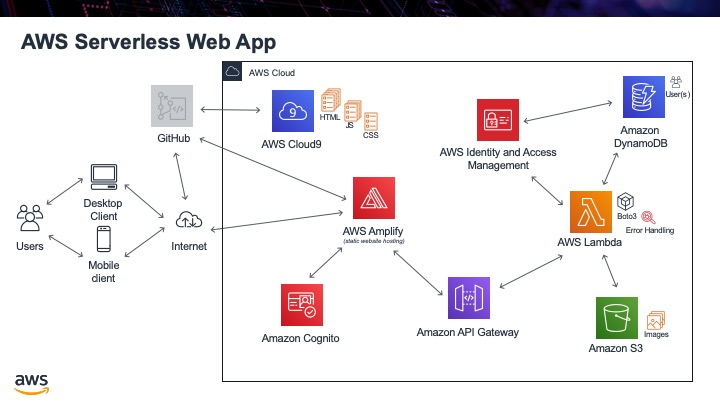

Home
====

In this project we will be making an AWS Serverless Web App. We will be using an AWS Educate Student account, so anyone should have enough permissions to make this app. It is assumed that you already have not only an AWS account but also a GitHub account and know basic HTML, CSS, JavaScript and Python for the back end.

.. seealso:: All the code can be found at `this GitHub <https://github.com/MotherTeresaHS/AWS-Serverless-Web-Application>`_ link.

.. toctree::
  :maxdepth: 1
  :hidden:
  :titlesonly:

  self
  step00
  step01
  step02
  step03
  step04
  step05
  step06
  step07
  step08
  step09
  step10
  step11
  step12
  step13
  step14
  step15
  step16
  step17
  step18
  step19
