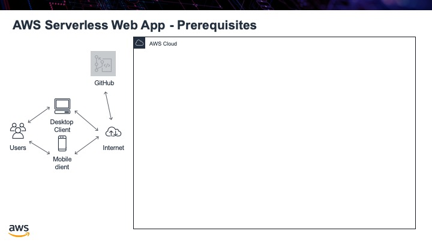

.. _step00:

*************
Prerequisites
*************

To do this tutorial, it is assumed that you have access to certain tools and that you know the basics of certain programming technologies. To be able to complete this tutorial you will need:

- Amazon Web Services (AWS) access. In the tutorial I will be using an AWS Education student account. It is more restrictive that a regular AWS account. All functionality in this tutorial is able to be done with a student account though.
- GitHub account. If you do not already have one, you can register for a free account.
- Basic HTML, CSS & JavaScript coding experience
- Basic JSON experience, since our Lambda function will be returning JSON as its output
- Baisc Python coding exerience, for doing the back end code in Lambda in Python
