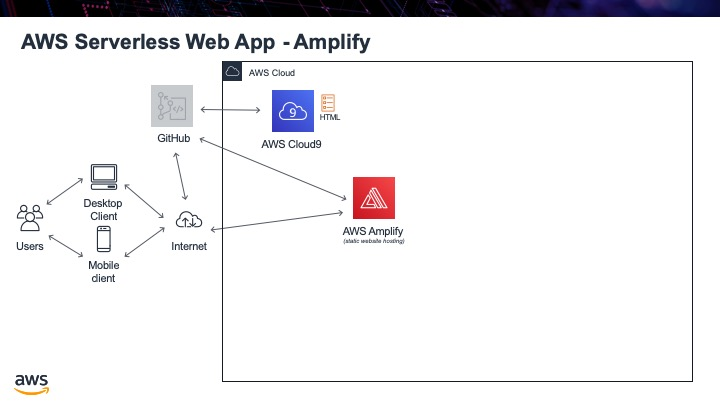

.. _step01:

*******
Amplify
*******

We will use AWS Amplify to host our web app so it is always available and we do not need to worry about provisioning servers, auto-scaling instances or anything else about managing web content. We will also use AWS Cloud9 as our IDE to write our HTML in and then publish all the code to GitHub as our version control system.

Tasks:

- create GitHub repo
- create Cloud9 instance, remember to delete the README.md file from CLoud9 since the GitRepo has one and you do not want any conflicts
- initialize git repo in Cloud9
- then change the default branch from "master" to "main" (since we no longer use the terminology master for repos)
- connect the root of Cloud9 instance to GitHub repo
- create ``index.html`` file in the root of Cloud9
- update GitHub repo
- create Amplify instance connected to GitHub repo
- ensure you select the "main" branch and not the "master" one we will not be using

.. code-block:: shell
	:caption: How to connect Cloud9 instance root to GitHub repo

	vocstartsoft:~/environment $ git init
	Initialized empty Git repository in /home/ubuntu/environment/.git/
	vocstartsoft:~/environment (master) $ git checkout -b main
	vocstartsoft:~/environment (master) $ git remote add origin https://github.com/Mr-Coxall/Amplify-Test
	vocstartsoft:~/environment (master) $ git pull origin main

.. code-block:: html
	:linenos:
	:caption: index.html

	<!DOCTYPE html>
	<html>
	  <head>
	    <title>AWS Serverless Web App</title>
	  </head>
	  <body>
	    Hello, World!
	  </body>
	</html>

.. raw:: html

  

		<iframe width="560" height="315" src="https://www.youtube.com/embed/kfHxzvBbOHo" frameborder="0" allow="accelerometer; autoplay; encrypted-media; gyroscope; picture-in-picture" allowfullscreen>
		</iframe>
  

