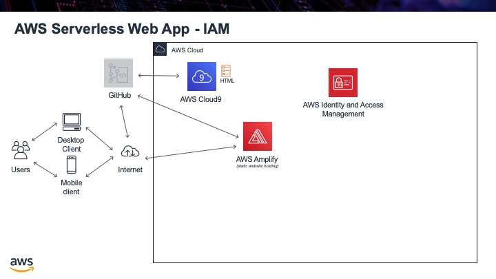

.. _step02:

****
IAM
****

Before we do any more work with AWS, the next thing we need is to create some permissions so we can give access to certain AWS services by other services. For example, eventually, we will want some code (Lambda function) to access the database. Unless we create permissions to let this happen, hopefully, the database will not just let anyone access it!

To do this, we will use AWS IAM (Identity and Access Management). We will create a "role" that will give Lambda functions permissions to access DynamoDB, the database we will be using.

Tasks:

- create a role in IAM, for Lambda to access DynamoDB

.. raw:: html

  

	<iframe width="560" height="315" src="https://www.youtube.com/embed/i3J2ZBBB7wM" frameborder="0" allow="accelerometer; autoplay; encrypted-media; gyroscope; picture-in-picture" allowfullscreen>
	</iframe>
  
