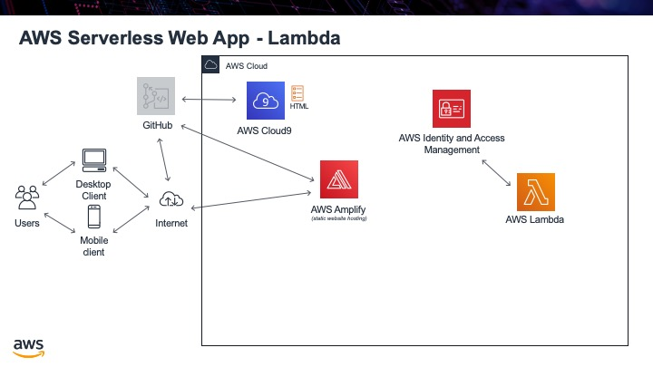

.. _step3:

***************
Lambda Function
***************

We will use AWS Lambda to run our back end code. The language we will use is Python, although other languages are available. Once again the advantage of running the code in AWS Lambda is that we need not worry about any provisioning and maintenance of servers, and their function will always be available. To start off with we will create just a simple "Hello, World!" program. Unlike normal programs where the output is for a user to see, the output from our Lambda function is for another program to use, so the output will be in a machine-friendly format, namely JSON.

Tasks:

- create a Lambda function that returns "Hello, World!"
- we need to ensure we use the "role" we just created previously
- we also need to create "test cases" for it to use as input when we test the function to ensure it is running correctly
- to save our changes to see if the test cases will run correctly, you need to click "Deploy"

.. code-block:: python
	:linenos:
	:caption: hello_world.py Lambda function

	#!/usr/bin/env python3

	# Created by: Mr. Coxall
	# Created on: Jan 2020
	# This function is the Hello, World! Lambda function

	import json

	def lambda_handler(event, context):
	    # TODO implement
	    
	    return_var = {
	        'statusCode': 200,
	        'body': json.dumps('Hello, ' + event['name'])
	    }
	    
	    return return_var

.. raw:: html

  

	<iframe width="560" height="315" src="https://www.youtube.com/embed/IBfbIfa1YFc" frameborder="0" allow="accelerometer; autoplay; encrypted-media; gyroscope; picture-in-picture" allowfullscreen>
	</iframe>
  

