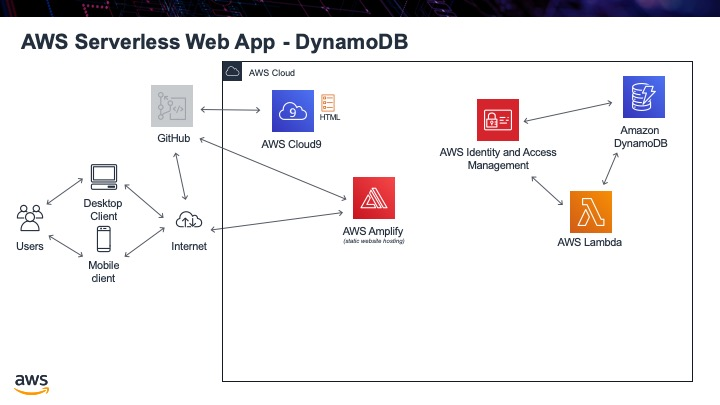

.. _step04:

********
DynamoDB
********

We will use AWS DynamoDB as our back-end database. This is a NoSQL database service, so if you have never used databases before, do not worry. Just assume that the table we create is just like a simple spreadsheet, it has rows with different information in it and it saves the information in columns. Just like a good spreadsheet, we need to have a unique "key" that uniquely identifies each row. In a spreadsheet, it usually has row numbers. In our example, we will use an email address, since that is a good unique key for a user of a web application.

Tasks:

- create a DynamoDB table
- we will place some data into our database by hand, just to ensure it works correctly
- change the "capacity" of the database because for our tests, we do not need so much power (and it will cost less!)

.. raw:: html

  

	<iframe width="560" height="315" src="https://www.youtube.com/embed/XmRuJX26RMM" frameborder="0" allow="accelerometer; autoplay; encrypted-media; gyroscope; picture-in-picture" allowfullscreen>
	</iframe>
  
