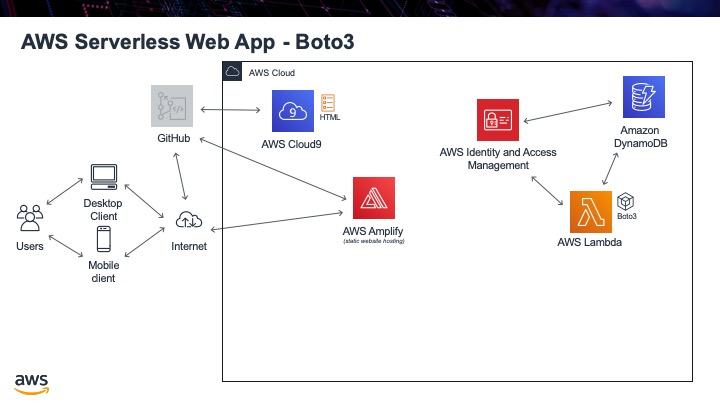

.. _step05:

*****
Boto3
*****

We will once again revisit Lambda functions. Now that we have a database with information in it, we can create a Lambda function that will retrieve a row (or several rows). As part of AWS, there is a Python library called Boto3. This library allows you to access any AWS service using Python code. We will use this library to access the DynamoDB, get back a JSON file, and then return it from Lambda.

There will be just one problem when we get back the data from DynamoDB. We created a row that was "age" and holds a "decimal" value type. It turns out that Boto3 returns this type of value in a *strange* format, that if we just returned it from lambda as JSON we would get an error. To prevent this, we will include a helper function that will re-format our decimal number value into something we can use.

Tasks:

- create a new Lambda function
- add in the Boto3 library to access the database
- query the database to return a row of information
- return the row in JSON format from the lambda function
- we will pull out the "Item" element from the returned data since that is what we are interested in
- if no row was returned, then we need to catch this case and return an empty return statement
- if there is a row returned, we need to re-format the "decimal" type, so that we do not get an error. We will once again revisit Lambda functions. Now that we have a database with information in it, we can create a Lambda function that will retrieve a row (or several rows). As part of AWS, there is a Python library called Boto3. This library allows you to access any AWS service using Python code. We will use this library to access the DynamoDB, get back a JSON file and then return it from Lambda.

.. code-block:: shell
    :caption: test case for Lambda function

	{
  	  "email_address": "jane.smith@gmail.com"
	}

.. code-block:: python
	:linenos:
	:caption: get_user_info.py Lambda function

	#!/usr/bin/env python3

	# Created by: Mr. Coxall
	# Created on: Jan 2020
	# This function returns a row from our chocolate_user DynamoDB

	import json
	import boto3
	import decimal

	def replace_decimals(obj):
		# Helper class to Decimals in an arbitrary object
		#   from: https://github.com/boto/boto3/issues/369
	    
	    if isinstance(obj, list):
	        for i in range(len(obj)):
	            obj[i] = replace_decimals(obj[i])
	        return obj
	    elif isinstance(obj, dict):
	        for k, v in obj.items():
	            obj[k] = replace_decimals(v)
	        return obj
	    elif isinstance(obj, set):
	        return set(replace_decimals(i) for i in obj)
	    elif isinstance(obj, decimal.Decimal):
	        if obj % 1 == 0:
	            return int(obj)
	        else:
	            return float(obj)
	    else:
	        return obj

	def lambda_handler(event, context):
	    # get a row from our chocolates_user table
	    
	    dynamodb = boto3.resource('dynamodb')
	    table = dynamodb.Table('chocolate_users')
	    response = table.get_item(
	        Key = {
	            'email':event['email_address']
	        }
	    )
	    
	    try:
	        results = response["Item"]
	        results = replace_decimals(results)
	    except:
	        results = {}
	    
	    return {
	        'statusCode': 200,
	        'body': json.dumps(results)
	    }

.. raw:: html

  

	<iframe width="560" height="315" src="https://www.youtube.com/embed/CHS5vOpMDUg" frameborder="0" allow="accelerometer; autoplay; encrypted-media; gyroscope; picture-in-picture" allowfullscreen>
	</iframe>
  

.. seealso:: Boto3 documentation for `DynamDB <https://boto3.amazonaws.com/v1/documentation/api/latest/reference/services/dynamodb.html>`_

.. seealso:: `DynamDB Python examples <https://docs.aws.amazon.com/amazondynamodb/latest/developerguide/GettingStarted.Python.html>`_
