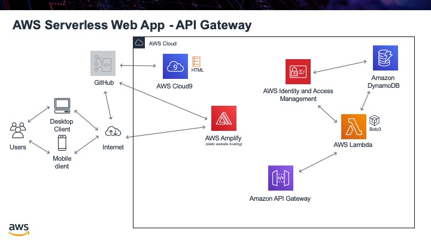

.. _step06:

***********
API Gateway
***********

Now that we have a Lambda function that will access our table and return information, we need to make that logic accessible on the Internet. This way we can write HTML and JavaScript code to get the information and present it on a web page. To do this, we will use AWS API Gateway.

API Gateway is a service that can make a Lambda function accessible by a URL. Just like our Lambda function needed a parameter passed to it to know what user information to get back, as part of the URL we will pass in what user information we would like back.

Tasks:

- create a new API Gateway
- add in CORS, so that any URL can access our API
- create a "GET" request, to get the user info
- add in a "mapping" template, to specify what parameters it allows to be passed in
- Enable CORS, or we cannot access the API due to being in different domains
- publish the API, so it is visible on the Internet

.. code-block:: shell
    :caption: Mapping Templates

	## set what the Lambda parameter is named : what name will be passed in the URL

	#set($inputRoot = $input.path('$'))
	{"email_address":"$input.params('user_email')"}

.. code-block:: shell
    :caption: Query Strings for testing

	user_email=jane.smith@gmail.com

.. raw:: html

  

	<iframe width="560" height="315" src="https://www.youtube.com/embed/B_xZgSDfJuk" frameborder="0" allow="accelerometer; autoplay; encrypted-media; gyroscope; picture-in-picture" allowfullscreen>
	</iframe>
  
