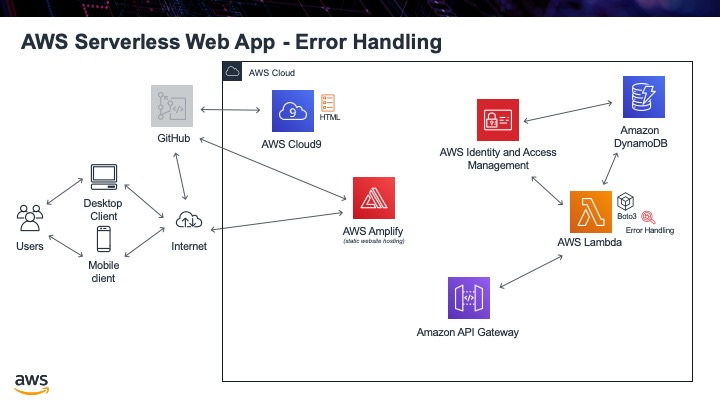

.. _step07:

**************
Error Handling
**************

Our API Gateway is now working if you pass the correct parameters into it. The next question is what happens if someone does not pass the proper parameters in or even no parameters at all? Sadly, we get a really nasty error message coming back. This is OK, but really we should be nice programmers and handle it better. What we will do is alter our Lambda code to trap these kinds of errors.

Tasks:

- use try and except to catch wrong or no parameters being passed

.. code-block:: python
	:linenos:
	:caption: get_user_info.py Lambda function, with error handling

	def lambda_handler(event, context):
	    # function returns a row from our chocolate_user DynmamoDB
	    
	    dynamodb = boto3.resource('dynamodb')
	    table = dynamodb.Table('chocolate_user')
	    
	    try:
	        response = table.get_item(
	            Key = {
	                'email':event['email_address']
	            }
	        )
	        
	        try:
	            result = response['Item']
	            result = replace_decimals(result)
	        except:
	            result = {}
	        
	        print(result)
	        
	        return_var = {
	            'statusCode': 200,
	            'body': json.dumps(result)
	        }
	    
	        return return_var
	        
	    except:
	       return {
	            'statusCode': 204,
	            'body': json.dumps({})
	        }

.. raw:: html

  

	<iframe width="560" height="315" src="https://www.youtube.com/embed/WdajbxYQmYU" frameborder="0" allow="accelerometer; autoplay; encrypted-media; gyroscope; picture-in-picture" allowfullscreen>
	</iframe>
  
