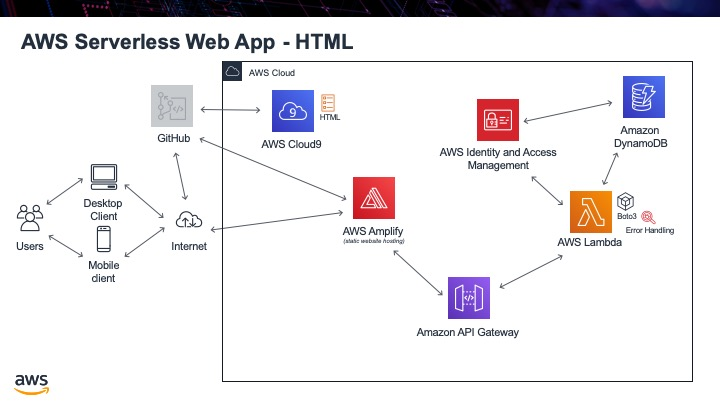

.. _step08:

****
HTML
****

Now that we have a fully functional API, let's write some HTML and JavaScript to show the information on a webpage. We will use the JavaScript "Fetch" method to call our API, get back the JSON file, parse out the information we want and then present that on our webpage inside a 
 element.

Tasks:

- add a ``
`` section to hold the data
- add a ``
	</html>

.. raw:: html

  

		<iframe width="560" height="315" src="https://www.youtube.com/embed/2lxjWoFeABU" frameborder="0" allow="accelerometer; autoplay; encrypted-media; gyroscope; picture-in-picture" allowfullscreen>
		</iframe>
  
