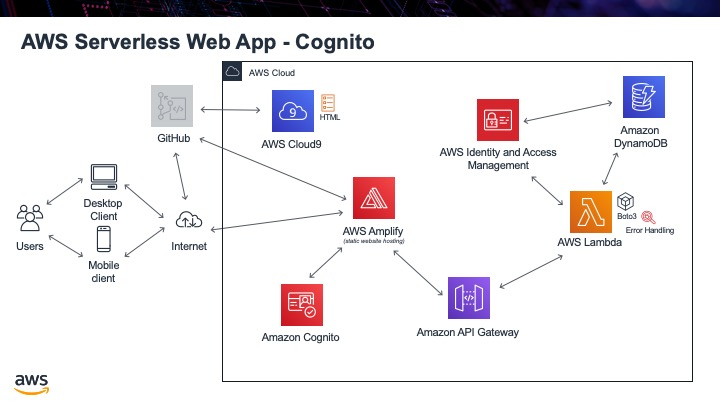

.. _step09:

*******
Cognito
*******

The next major task is to have the ability to sign in to our website. This prevents people from accessing things they should not and will also give us the ability to present individualized content for a particular user that has signed in since we know who is looking at the website. So instead of us hard coding the user email address to get back the information from the database, since a user has signed in, it should automatically return their information.

To do this, we will use an AWS service called Cognito. This will provide all user account management; importantly managing the user's login and password. You *do not want to manage the user's passwords yourself*, this is a really, really complicated thing to do properly (see the video below on why you should never save user passwords yourself). To avoid this, AWS Cognito will manage our user login, the email address, and the passwords.

Tasks:

- create an AWS Cognito user pool
- create an app client
- use the Cognito built-in signup URL to create a user and click on the provided link to confirm the user
- confirm the user now exists in the Congnito pool
- ensure this user also exists in the DynamoDB table, so that this user has information in your table

.. raw:: html

  

		<iframe width="560" height="315" src="https://www.youtube.com/embed/8ZtInClXe1Q" frameborder="0" allow="accelerometer; autoplay; encrypted-media; gyroscope; picture-in-picture" allowfullscreen>
		</iframe>
  

.. raw:: html

  

		<iframe width="560" height="315" src="https://www.youtube.com/embed/8jlL-HKsE_Q" frameborder="0" allow="accelerometer; autoplay; encrypted-media; gyroscope; picture-in-picture" allowfullscreen>
		</iframe>
  

.. seealso:: Most of my Cognito code came from `this <https://github.com/nrao57/AWS-Cognito-Tutorials>`_ tutorial
