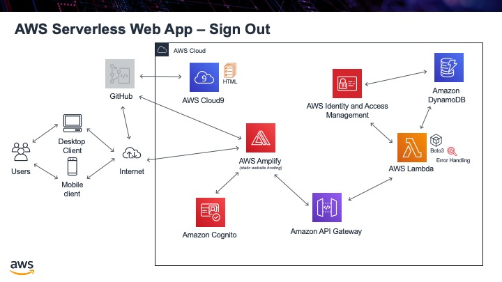

.. _step11:

********
Sign Out
********

Users can now sign in to our app and we can return their email address. The next logical step is to allow users to log out of the app, so someone else can not just get access to their data. To log out, we will use the same Cognito libraries, we will literally just call the **signout()** method and this will sign the user out. We will not use a button but call the JavaScript function as soon as the webpage loads.

Tasks:

- write file ``sign-out.html``, that just has some text explaining you are now signed out
- write the JavaScript function to sign the user out
- confirm they actually sign the user in, and write this to the console just to prove it is working, then call **signout()** function

.. code-block:: html
  :linenos:
  :caption: sign-out.html

  <!doctype html>
  <html lang="en">
    <head>
      <meta charset="utf-8">
      <!--Cognito JavaScript-->
        
      
    </head>

    <body>
    

      

        <h1>Sign Out</h1>
        
Successfully signed-out

      

       
      

        

        <a href='./index.html'>Home</a>
        

      

    

    

    </body>
  </html>

.. raw:: html

  

    <iframe width="560" height="315" src="https://www.youtube.com/embed/Q0yzX1cc9Zo" frameborder="0" allow="accelerometer; autoplay; encrypted-media; gyroscope; picture-in-picture" allowfullscreen>
    </iframe>
  

