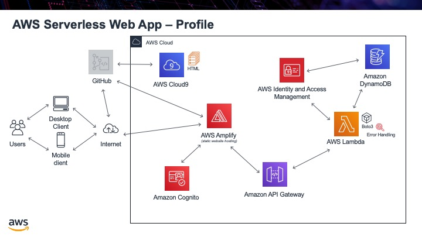

.. _step12:

*******
Profile
*******

The next big step is to confirm that we can integrate what we have in ``temp.html``, the ability to get user information from the database, with our ability to sign in a user. What we want is that after the user has signed in, go to a web page and automatically call the API to show the user info from the database.

To do this, we will take the ``sign-out.html`` code and copy it. We will remove the function that signs the user out, but keep the bit that confirms we sign the user in. Once we confirm we sign the user in, we will copy the function from ``sign-in.html`` that returns the user's email address. We will call this function, grab the email address, and pass it as a parameter into the function from temp.html that calls the API. This will then hopefully return the user info from the database.

Tasks:

- copy ``sign-out.html``
- remove sign-out code
- copy over **getUserAttributes()** function from ``sign-in.html``
- copy over **getUser()** function from ``temp.html``
- show profile results in div

.. code-block:: html
  :linenos:
  :caption: profile.html

  <!doctype html>
  <html lang="en">
    <head>
      <meta charset="utf-8">
      <!--Cognito JavaScript-->
        
      
    </head>

    <body>
    

      

        <h1>Profile</h1>
      

      

        

      

    

        
       
      

        

          <a href='./index.html'>Home</a>
        

      

    
      
    </body>
  </html>

.. raw:: html

  

    <iframe width="560" height="315" src="https://www.youtube.com/embed/n8cfgANsLwA" frameborder="0" allow="accelerometer; autoplay; encrypted-media; gyroscope; picture-in-picture" allowfullscreen>
    </iframe>
  

.. warning:: The above code is a **really** bad way to write this. Anyone can look at the html and see the line: ``const api_url = 'https://gonvpjbyuf.execute-api.us-east-1.amazonaws.com/prod/user-profile?user_email=' + email_address;`` and then just place any email address they want in. Once they find a valid email address, they will then get full access to all the user's info. I know it is un-secure but for now we are going to leave it 😊.
